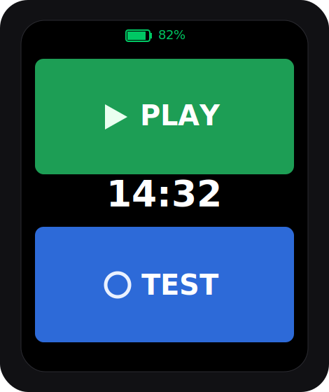
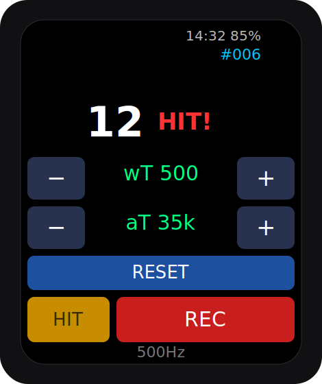
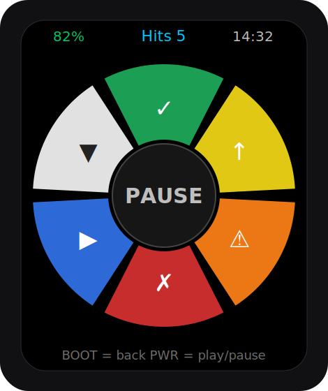
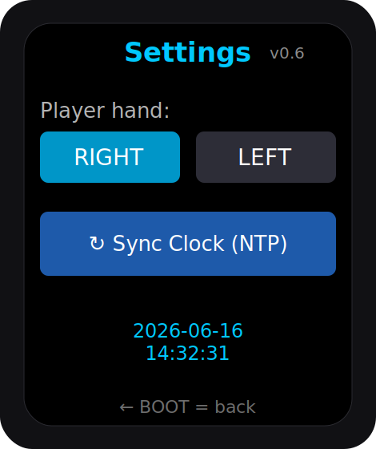

# ESP32-S3 Tennis Monitoring Wearable

Tennis performance wearable firmware for the **Waveshare ESP32-S3-Touch-AMOLED-2.06** smartwatch. Worn on the hitting hand, it detects strokes with a dual-gate gyroscope algorithm, logs full-rate IMU data to SD for offline analysis, and lets you tag point outcomes live during a match.

Built with **ESP-IDF v5.5.2** + **LVGL 9**.

## Hardware

| Component | Chip | Bus |
|-----------|------|-----|
| MCU | ESP32-S3R8 (8 MB PSRAM) | — |
| Display | SH8601 AMOLED 410×502 | QSPI |
| Touch | FT3168 | I²C |
| IMU | QMI8658 (accel + gyro) | I²C |
| PMIC | AXP2101 | I²C |
| RTC | PCF85063A | I²C |
| Audio | ES8311 + NS4150B | I²S |
| Storage | microSD | SDMMC 1-bit |

## Features

- **Home** — battery, live clock, mode selection; AMOLED dim-to-clock screen-sleep.
- **Test & Tune** — live hit detection with on-device ω/α threshold tuning and SD recording (HIT-capture or ALL modes).
- **Play** — play/pause match logging with a 6-slice outcome dial (good hit, out, bad hit, unforced error, first serve in, lost point); per-session folder with hit log + outcome counts.
- **Config** — handedness, on-demand WiFi→NTP clock sync, live RTC date/time, firmware version.
- **Power management** — IMU idled off the tuning screen, DFS, screen-sleep.

## Using the watch

Two physical buttons drive navigation (the touchscreen handles on-screen controls):

- **BOOT (GPIO0)** — **back** to the Home screen (from Test it also stops & saves any active recording).
- **PWR (GPIO10)** — power on; on **Home** opens **Config**; in **Play** it's **play/pause**.

> The screens below are illustrative mockups of the firmware layout.

| Home | Test &amp; Tune |
|:---:|:---:|
|  |  |
| Battery, live clock, and two big buttons: **PLAY** and **TEST**. Dims to a clock-only sleep after 30 s — tap to wake. | Live hit counter; tune detection with **−/+** around **wT** (ω) and **aT** (α); **RESET** the detector; **HIT/ALL** mode; **REC** to record to SD. |

| Play | Config |
|:---:|:---:|
|  |  |
| Tap the matching slice to tag each point — ✓ good hit, ↑ out, ⚠ bad hit, ✗ unforced error, ▶ first serve in, ▼ lost point. Center shows **PLAY/PAUSE** (toggle with PWR). Top row: battery · session hits · clock. | Pick your **playing hand** (improves forehand/backhand analysis), **Sync Clock** over WiFi/NTP, and check the live date/time. Firmware version shown top-right. |

### Recording a session

1. **Set your hand** in Config (Right/Left), and **Sync Clock** once so files are dated correctly.
2. **Play mode** (Home → PLAY): press **PWR** to start (**PLAY**), tag each point on its slice, **PWR** to pause between games, **BOOT** when done. A folder `PlaySession_YYYY-MM-DD_HH-MM/` is written to the SD with `hits.csv`, `outcomes.txt`, and `events.csv`. The session also auto-ends on low battery (≤3 %) or 30 min idle.
3. **Test & Tune** (Home → TEST): press **REC** to log raw IMU to `ses_NNN_full.csv` (ALL) or `ses_NNN_hit.csv` (HIT-capture) for offline analysis.

### Analysing a session (`scripts/`)

```bash
python scripts/session_report.py Data/PlaySession_YYYY-MM-DD_HH-MM   # -> report.html
```
Generates a session report (strokes, rallies, forehand/backhand, swing speed, outcomes). Run `scripts/calibrate.py` once on a labeled block recording to enable calibrated forehand/backhand + spin (topspin/flat/slice).

## Hit detection

Dual-gate on gyro magnitude **ω** = √(gx²+gy²+gz²) and angular acceleration **α** = |Δω/dt|, with an alpha look-back window to bridge the rising-edge/peak gap. State machine: IDLE → IN_HIT → REFRACTORY. See [`HIT_DETECTION_SPEC.md`](HIT_DETECTION_SPEC.md).

## Build & flash

```bash
idf.py build
idf.py -p <PORT> flash
```

## Repository layout

```
main/                  Application (UI, screens, detection glue, logging, power)
components/qmi8658/     IMU driver
components/hit_detector/ Hit detection algorithm (pure C)
scripts/               Offline analysis: session_report.py, calibrate.py, analyze_hits.py
docs/screens/          Screen mockups used in this README
sdkconfig.defaults     Project config (sdkconfig is generated)
CLAUDE.md              Detailed project context / architecture notes
DevelopmentLog.md      Session-by-session development history
```

## Documentation

- [`CLAUDE.md`](CLAUDE.md) — architecture, pin map, gotchas, power notes, AXP2101 rail map.
- [`DevelopmentLog.md`](DevelopmentLog.md) — full build history.
- [`Play Mode — Phase 1 Implementation Plan.md`](Play%20Mode%20%E2%80%94%20Phase%201%20Implementation%20Plan.md) — Play mode spec.
